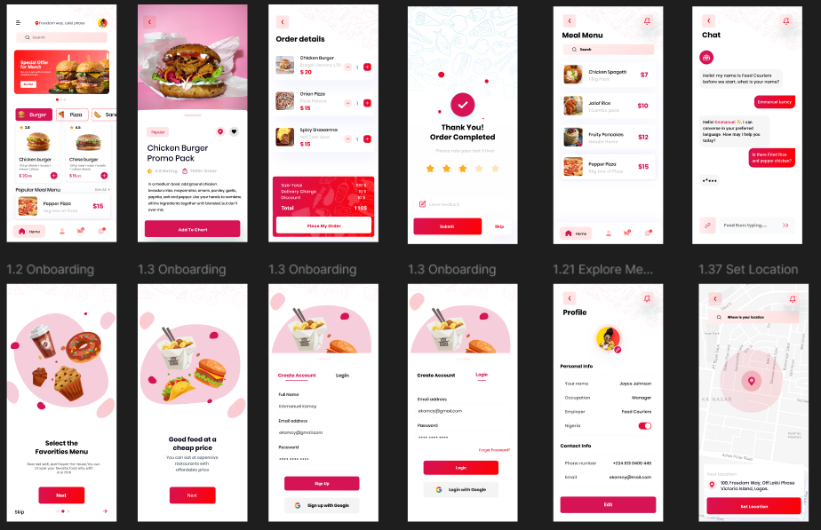

# 🍕 Foodie Express
> A modern food delivery application with smooth animations, dynamic search, and responsive design — built with Flutter.


## 📱 Screenshots
| Home | Menu | Cart |
|------|------|------|
|  |  |  |
## ✨ Features
- ✅ **Dynamic Search**: Real-time search with debouncing for smooth UX
- ✅ **Optimized Images**: Cached network images for instant loading
- ✅ **Smooth Animations**: Hero transitions and micro-interactions
- ✅ **Responsive Layout**: Adapts to any screen size
- ✅ **60fps Performance**: Optimized widget tree for butter-smooth scrolling
- ✅ **Clean UI**: Modern design with custom components
## 🔧 Tech Stack
| Category | Technology |
|----------|-----------|
| **Framework** | Flutter 3.x |
| **Language** | Dart |
| **State Management** | BLoC / Cubit |
| **Image Caching** | CachedNetworkImage |
| **Design** | Material Design 3 |
## 🏃 Getting Started
```bash
git clone https://github.com/asherifo/foodie-express.git
cd foodie-express
flutter pub get
flutter run
